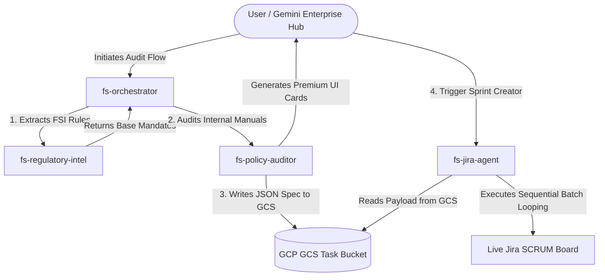

# 🏦 Financial Services (FSI) Regulatory Compliance & Engineering Remediation Suite

[](https://cloud.google.com/products/agent-engine)
[](https://cloud.google.com/gemini/enterprise)
[](https://cloud.google.com/run)
[](#)
[](https://python.org)

An enterprise-grade, fully autonomous multi-agent orchestration pipeline built with the **Google Agent Development Kit (ADK)**. This solution demonstrates how **Gemini Enterprise** acts as your centralized intelligence hub to execute and orchestrate highly complex Financial Services (FSI) regulatory compliance and engineering workflows in a secure, automated, and serverless environment.

Successfully presented at customer Executive Briefing Centers (EBC) as a premium benchmark for multi-agent workflows.

---

## 🏗️ Multi-Agent Swarm Architecture

The core orchestration operates entirely through event-driven, serverless A2A microservices located in the [`agents/`](file:///usr/local/google/home/iamsouvik/fs-regulatory-compliance/agents) suite. Each specialized sub-agent handles a distinct lifecycle phase:



### Core Microservices Overview

*   🤖 **[`fs-orchestrator`](file:///usr/local/google/home/iamsouvik/fs-regulatory-compliance/agents/fs-orchestrator)**: The master multi-agent coordinator that manages contextual state, evaluates user requests, and delegates execution.
*   📜 **[`fs-regulatory-intel`](file:///usr/local/google/home/iamsouvik/fs-regulatory-compliance/agents/fs-regulatory-intel)**: The rule extraction engine specialized in deep-parsing external SEC Form PF instructions, FINRA Rule 3310 requirements, and complex investment structures.
*   🔍 **[`fs-policy-auditor`](file:///usr/local/google/home/iamsouvik/fs-regulatory-compliance/agents/fs-policy-auditor)**: Performs multi-stage gap analysis against internal baseline manuals. It formats results into an elegant 5-column schema, generates interactive **A2UI Compliance Cards**, and writes structured `remediation_spec.json` payloads to Google Cloud Storage.
*   🎫 **[`fs-jira-agent`](file:///usr/local/google/home/iamsouvik/fs-regulatory-compliance/agents/fs-jira-agent)**: A developer assistant that automatically reads GCS payloads, dynamically loops through all remediation tasks, and files separate, fully-mapped support tickets directly onto engineering SCRUM Sprint boards.

---

## 📊 Premium Visual Highlights

*   **Mixed-Table Gap Analysis**: Native prompt structures enforce a unified 5-column audit table featuring **`Original Text`** (base external rule or firm baseline) and **`Altered Text`** (mandated compliance target).
*   **A2UI Visual Dashboards**: Renders custom visual dashboard cards inside Gemini Enterprise, featuring complete dynamic priority headers (**`🔴 CRITICAL`**, **`🔴 HIGH`**, **`🟡 MEDIUM`**, **`🟢 LOW`**).
*   **Automated Batch Jira Looping**: Replaces fragile monolithic JSON ticket dumps with dynamic Python sequential looping, filing individual trackable Jira tasks mapped directly to active Sprints (`SCRUM Sprint 0`) and Epics (`GE App Demo`).

---

## 🛠️ Setup & Deployment Guide

> [!IMPORTANT]
> **Individual Agent Documentation**: Each microservice under `agents/` is completely modular and self-contained. **You must review the individual `README.md` files inside each specific agent directory** for granular local setup, environment variables (`.env`), and detailed build/deployment instructions.

*   📖 [Orchestrator Agent README](file:///usr/local/google/home/iamsouvik/fs-regulatory-compliance/agents/fs-orchestrator/README.md)
*   📖 [Regulatory Intel Agent README](file:///usr/local/google/home/iamsouvik/fs-regulatory-compliance/agents/fs-regulatory-intel/README.md)
*   📖 [Policy Auditor Agent README](file:///usr/local/google/home/iamsouvik/fs-regulatory-compliance/agents/fs-policy-auditor/README.md)
*   📖 [Jira Dev Agent README](file:///usr/local/google/home/iamsouvik/fs-regulatory-compliance/agents/fs-jira-agent/README.md)

### Quick Start Summary

1.  **Clone the Repository**:
    ```bash
    git clone <repository-url>
    cd fs-regulatory-compliance
    ```
2.  **Configure Environment Variables**: Navigate into each specific sub-agent folder and duplicate `.env.sample` to `.env`. Ensure your GCS bucket name (`vertexai-l300-capstone-dev-handoff`) and Jira board credentials are fully supplied.
3.  **Deploy to GCP Cloud Run**:
    Execute `make deploy` within each independent microservice directory to build and push the containers to Google Cloud.
